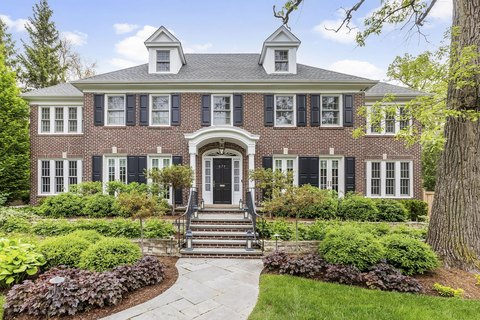

# Housing Prices Prediction

## Overview
The dataset consists of over 500,000 records from Cook County, Illinois, the county where Chicago is located. The dataset has 61 features in total; the 62nd is sales price, which we will predict with linear regression in the next part of this project. An explanation of each variable can be found in the included `codebook.txt` file (you can open this by clicking the `codebook.txt` file in the navigation pane). Some of the columns have been filtered out to ensure this assignment doesn't become overly long when dealing with data cleaning and formatting.

The data are split into training and test sets with 204,792 and 68,264 observations, respectively, but we will only be working on the training set for this part of the project.

___

This project has two parts. The first part of the project will perform Exploratory Data Analysis (EDA) including feature engineering to clean out, and understand the data. In the second part, I will apply linear regression method to predict the accurate housing prices for houses in Cook County, Chicago, IL.

### Contents
- [projA1](https://github.com/JC01111/Machine-Learning-Projects/blob/main/Housing%20Prices%20Prediction/projA1.ipynb)

- [projA2](https://github.com/JC01111/Machine-Learning-Projects/blob/main/Housing%20Prices%20Prediction/projA2.ipynb)