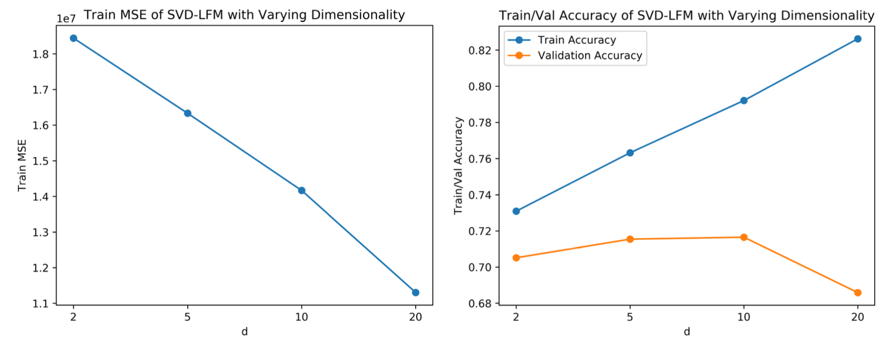
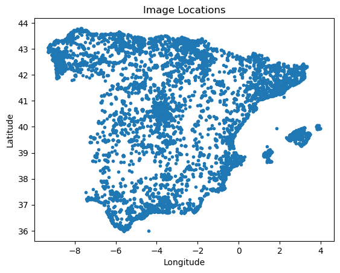
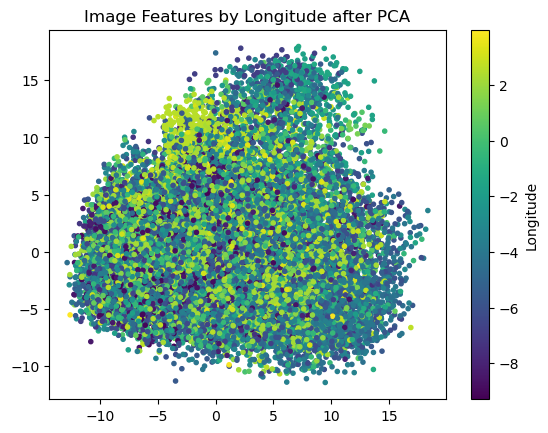

# Movie Recommender System and Geo-location with k-NN

<p align="center">


## Overview
This project has two parts: 
1. I built a personalized movie recommender system by using SVD to perform Latent Semantic Analysis, and use it to construct a Latent Factor Model (LFM) for personalized recommendation. 
2. I used k-nearest neighbors to predict latitude and longitude coordinates of images from their CLIP embeddings. 

For exact implementation, look at the [Movie Recommender System & Geo-location with k-NN.ipynb](https://github.com/JC01111/Machine-Learning-Projects/blob/main/Movie%20Recommender%20%26%20Geo-location%20with%20k-NN/Movie%20Recommender%20%26%20Geo-location%20with%20k-NN.ipynb)

### Contents
- [Movie Recommender System](https://github.com/JC01111/Machine-Learning-Projects/tree/main/Movie%20Recommender%20&%20Geo-location%20with%20k-NN#movie-recommender-system)
    1. [SVD to learn low-dimensional vector representations](https://github.com/JC01111/Machine-Learning-Projects/tree/main/Movie%20Recommender%20&%20Geo-location%20with%20k-NN#1-svd-to-learn-low-dimensional-vector-representations)
    2. [Mean Squared Error (MSE) Loss](https://github.com/JC01111/Machine-Learning-Projects/tree/main/Movie%20Recommender%20&%20Geo-location%20with%20k-NN#2-mean-squared-error-mse-loss)
    3. [Compute Training MSE and Validation Accuracy of SVD LFM for various d](https://github.com/JC01111/Machine-Learning-Projects/tree/main/Movie%20Recommender%20&%20Geo-location%20with%20k-NN#3-compute-training-mse-and-validation-accuracy-of-svd-lfm-for-various-d)
    4. [Learn better user/movie vector representations by minimizing loss](https://github.com/JC01111/Machine-Learning-Projects/tree/main/Movie%20Recommender%20&%20Geo-location%20with%20k-NN#4-learn-better-usermovie-vector-representations-by-minimizing-loss)
- [Geo-location with k-NN](https://github.com/JC01111/Machine-Learning-Projects/tree/main/Movie%20Recommender%20&%20Geo-location%20with%20k-NN#geo-location-with-k-nn)
  1. [Data Visualization](https://github.com/JC01111/Machine-Learning-Projects/tree/main/Movie%20Recommender%20&%20Geo-location%20with%20k-NN#1-data-visualization)
  2. [Find 3 nearest neighbors](https://github.com/JC01111/Machine-Learning-Projects/tree/main/Movie%20Recommender%20&%20Geo-location%20with%20k-NN#2-find-3-nearest-neighbors)
  3. [Mean Displacement Error](https://github.com/JC01111/Machine-Learning-Projects/tree/main/Movie%20Recommender%20&%20Geo-location%20with%20k-NN#3-mean-displacement-error)

## Movie Recommender System
Suppose that there are $m = 100$ movies and $n = 24,983$ users in total, and each user has watched and rated a subset of the $m$ movies. Our goal is to recommend more movies for each user given their preferences.

Our historical ratings dataset is given by a matrix $R \in \mathbb{R}^{n×m}$, where $R_{ij}$ represents the rating that user $i$ gave movie $j$. The rating is a real number in the range $[−10, 10]$: a higher value indicates that the user was more satisfied with that movie. If user $i$ did not rate movie $j$, $R_{ij} = \text{NaN}$.

The singular value decomposition (SVD) is a powerful tool to decompose and analyze matrices. By convention,
we know that the SVD can be used to efficiently compute the principal coordinates of a data matrix for PCA. Here, we will see that SVD can also produce dense, compact featurizations of the variables in the input ma-
trix (in our case, the $m$ movies and $n$ users). This application of SVD is known as Latent Semantic Analysis, and we can use it to construct a Latent Factor Model (LFM) for personalized recommendation.

Specifically, we want to learn a feature vector $x_i\in R^d$ for user $i$ and a feature vector $y_j\in R^d$ for movie $j$ such that the inner product $x_i\cdot y_j$ approximates the rating $R_{ij}$ that user $i$ would give movie $j$.

___

### 1. SVD to learn low-dimensional vector representations
After I preprocessed some data and wrote some help functions, for part (c), I started performing the SVD by replacing all missing (NaN) values in $R$ with $0$. Then, compute the SVD of the resulting matrix, and follow the below derivations to compute the feature vector representations for each user and movie.
$$R_{ij} = (x_iD)\cdot y_j$$

Where: <br>
$x_i$ is the $i\text{th}$ row of $U$, as a row vector <br>
$D$ is the diagonal matrix of singular values <br>
$y_j$ isthe $j\text{th}$ row of $V$ ($j\text{th}$ col of $V^T$), as a row vector. <br>

### 2. Mean Squared Error (MSE) Loss
To measure the training performance of the model, I used the mean squared error (MSE) loss as the following expression.
$$\text{MSE} = \sum_{(i, j) \in S} (x_i \cdot y_j - R_{ij})^2 \quad \text{where } S := \{(i, j) : R_{ij} \neq \text{NaN}\}.$$

### 3. Compute Training MSE and Validation Accuracy of SVD LFM for various d
Our model as constructed may achieve 100% training accuracy, but it is prone to overfitting. Instead,
we would like to use lower-dimensional representations for $x_i$ and $y_j$ to approximate our known ratings
closely while still generalizing well to unknown user/movie combinations. Specifically, we want each
$x_i$ and $y_j$ to be d-dimensional for some $d < m$, such that only the top $d$ features are used to make
predictions $x_i\cdot y_j$. The “top $d$ features” are those corresponding to the $d$ largest singular values: use this as a hint for how to prune your current user/movie vector representations to d dimensions.

In my code, I computed pruned user/movie vector representations with $d = 2, 5, 10, 20$. Then, for each setting, compute the training MSE (using the function you implemented in part (d)), the training accuracy (using the provided get train acc), and the validation accuracy (using the provided get val acc). Plot the training MSE as a function of $d$ on one plot, and the training and validation accuracies as a function of $d$ together on a separate plot.

<p align="center">


From the plots, $d = 10$ is optimal since it produces the highest validation accuracy of $71.65$%.

### 4. Learn better user/movie vector representations by minimizing loss
For sparse data, replacing all missing values with zero, as we did in part (c), is not a very satisfying solution. A missing value in the training matrix $R$ means that the user has not watched the movie; this does not imply that the rating should be zero. Instead, we can learn our user/movie vector representations by minimizing the MSE loss, which only incorporates the loss on rated movies $R_{ij} \neq \text{NaN}$.

Let's define a loss function
$$L(\\{x_i\\}, \\{y_j\\}) = \sum_{(i,j) \in S} (x_i \cdot y_j - R_{ij})^2 + \sum_{i=1}^{n} \||x_i\||_2^2 + \sum _{j=1}^m \||y_j\||^2_2$$

where $S$ has the same definition as in the MSE. This is similar to the original MSE loss, except with two additional regularization terms to prevent the norms of the user/movie vectors from getting too large.

Implement an algorithm to learn vector representations of dimension $d$, the optimal value you found in part (e), for users and movies by minimizing $L(\\{x_i\\}, \\{y_j\\})$.

Here is an alternating minimization scheme. First, randomly initialize $x_i$ and $y_j$ for all $i, j$. Then, minimize the above loss function with respect to the $x_i$ by treating the $y_j$ as constant vectors, and subsequently minimize the loss with respect to the $y_j$ by treating the $x_i$ as constant vectors. Repeat these two steps for a number of iterations. Note that when one of the $x_i$ or $y_j$ are constant, minimizing the loss function with respect to the other component has a closed-form solution. **Here is the derivation of the solution.**

- **Given**: dataset $R$ with NaNs, randomly initialized vectors $x \in \mathbb{R}^{n \times d}$, $y \in \mathbb{R}^{m \times d}$.
- **Consider** $y$ to be fixed, then we have for every $x_i$

$$\nabla_{x_i} L(\{x_i\}, \{y_j\}) = \sum_{(i,j) \in S} 2(x_i \cdot y_j - R_{ij})y_j + 2x_i$$

$$= 2 \sum_{(i,j) \in S} (y_j y_j^T x_i - R_{ij} y_j) + 2x_i$$

This gradient is 0 at optimality (sufficient since the objective is convex when $y_j$ is held constant).

$$\therefore \sum_{(i,j) \in S} (y_j y_j^T x_i - R_{ij} y_j) + x_i = 0$$

$$\left( \sum_{(i,j) \in S} y_j y_j^T + I_d \right) x_i = \sum_{(i,j) \in S} R_{ij} y_j \quad \text{(for every } x_i \text{)}$$

$$\therefore x_i = \left( \sum_{(i,j) \in S} y_j y_j^T + I_d \right)^{-1} \sum_{(i,j) \in S} R_{ij} y_j$$

- Similarly, for each $y_j$ if we set $x$ to be fixed, we get

$$y_j = \left( \sum_{(i,j) \in S} x_i x_i^T + I_d \right)^{-1} \sum_{(i,j) \in S} R_{ij} x_i \quad \text{(for every } y_j \text{)}$$

- For iteration $t \in [T]$ we alternate between updating $x$ and $y$ with these update rules.

<br>

```
Start optim, train MSE: 27574866.30, train accuracy: 0.5950, val accuracy: 0.5799
Iteration 1, train MSE: 13421216.24, train accuracy: 0.7611, val accuracy: 0.6431
Iteration 2, train MSE: 11474959.41, train accuracy: 0.7876, val accuracy: 0.6789
Iteration 3, train MSE: 10493324.86, train accuracy: 0.8007, val accuracy: 0.6989
Iteration 4, train MSE: 10040997.98, train accuracy: 0.8069, val accuracy: 0.7084
Iteration 5, train MSE: 9792296.83, train accuracy: 0.8098, val accuracy: 0.7100
Iteration 6, train MSE: 9649312.88, train accuracy: 0.8117, val accuracy: 0.7100
Iteration 7, train MSE: 9561491.69, train accuracy: 0.8130, val accuracy: 0.7060
Iteration 8, train MSE: 9503837.41, train accuracy: 0.8138, val accuracy: 0.7117
Iteration 9, train MSE: 9463660.97, train accuracy: 0.8144, val accuracy: 0.7111
Iteration 10, train MSE: 9434168.95, train accuracy: 0.8147, val accuracy: 0.7087
Iteration 11, train MSE: 9411512.64, train accuracy: 0.8150, val accuracy: 0.7119
Iteration 12, train MSE: 9393397.49, train accuracy: 0.8152, val accuracy: 0.7103
Iteration 13, train MSE: 9378404.19, train accuracy: 0.8155, val accuracy: 0.7125
Iteration 14, train MSE: 9365635.88, train accuracy: 0.8156, val accuracy: 0.7122
Iteration 15, train MSE: 9354518.75, train accuracy: 0.8157, val accuracy: 0.7125
Iteration 16, train MSE: 9344681.51, train accuracy: 0.8158, val accuracy: 0.7136
Iteration 17, train MSE: 9335879.18, train accuracy: 0.8159, val accuracy: 0.7144
Iteration 18, train MSE: 9327944.20, train accuracy: 0.8160, val accuracy: 0.7146
Iteration 19, train MSE: 9320755.69, train accuracy: 0.8161, val accuracy: 0.7149
Iteration 20, train MSE: 9314221.76, train accuracy: 0.8163, val accuracy: 0.7160
```

## Geo-location with k-NN
For this problem, we will use nearest neighbors (NN or k-NN) to predict latitude and longitude coordinates of images from their CLIP embeddings.

We are using a dataset of images scraped from Flickr with geo-tagged locations within Spain. Each image has been processed with OpenAI’s CLIP image model (https://github.com/openai/CLIP) to produce features that can be used with k-NN.

The CLIP model was not explicitly trained to predict coordinates from images, but from task-agnostic pre-training on a large web-crawl dataset of captioned images has learned a generally useful mapping from images to embedding vectors. These feature vectors turn out to encode various pieces of information about the image content such as object categories, textures, 3D shapes, etc. In fact, these very same features were used to filter out indoor images from outdoor images in the construction of this dataset

**Note**: Throughout the problem we use MDE which stands for Mean Displacement Error (in miles). Dis- placement is the (technically spherical) distance between the predicted coordinates and ground truth coordinates. Since all our images are located within a relatively small region of the globe, we can approximate spherical distances with Euclidean distances by treating latitude/longitude as cartesian coordinates. Assume 1 degree longitude is equal to 69 miles and 1 degree latitude is 52 miles in this problem.

___

### 1. Data Visualization
Visualize the data by using matplotlib and scikit-learn, plot the image locations and modify the code to apply PCA to the image features. Plot the data in its first two PCA dimensions, colored by longitude coordinate (east-west position).

<p align="center">


</p>

### 2. Find 3 nearest neighbors
Find the three nearest neighbors in the training set of the test image file 53633239060.jpg. And look at their coordinates. How many of the 3 nearest neighbors are “correct”?
<p align="center">


['31870484468.jpg' '4554482343.jpg' '53643099910.jpg']
```
Test Coord: [37.380455 -5.993931]
Train Coord: [[[37.380424 -5.994328]
  [40.036533 -3.609201]
  [37.38637  -5.992387]]]
```
Two of these nearest neightbors are correct.

**Note:** k-NN algorithm is almost like this, we test a datapoint on training data, and find the `k` nearest neighbors.

### 3. Mean Displacement Error
Before we begin with our k-NN model, we first establish a naive constant baseline of simply predicting the training set centroid (coordinate-wise average) location for every test image. 

The naive baseline should yield a mean displacement error of 209.9 miles on the test set images.

