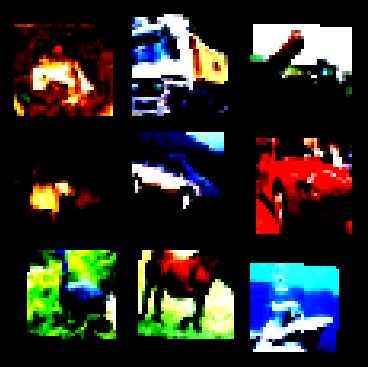

# Machine Learning Projects
I included some my machine learning projects here. Each folder has a `.ipynb` file of my work and a `.pdf` version of the jupyternotebook for reading. Notice that some projects do not include datasets, for some datasets you can download from the link in my work.

## Overview:
Here are the links to some famous machine learning tasks. 

### [Movie Recommender System & Geo-location](/Movie%20Recommender%20&%20Geo-location%20with%20k-NN/)

### [CIFAR-10 Classification](/CIFAR-10%20Classification%20with%20CNN/)

### [Titanic Survival Prediction](/Titanic%20survival%20Prediction%20with%20Random%20Forests/)

### [MNIST & Spam Classification](/MNIST%20&%20Spam%20Classification/)

### [Wine Classification](/Wine%20Classification%20with%20Logistic%20Regression/)

### [Housing Prices Prediction](/Housing%20Prices%20Prediction/)
