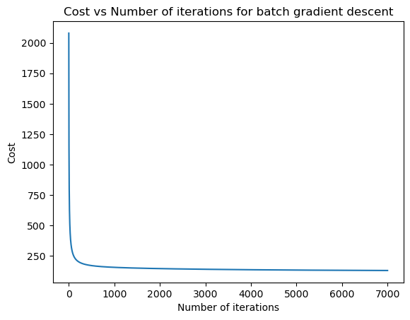
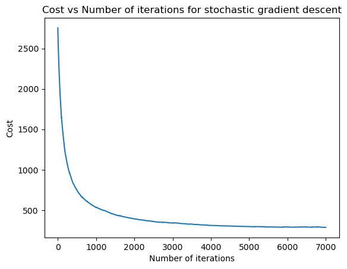
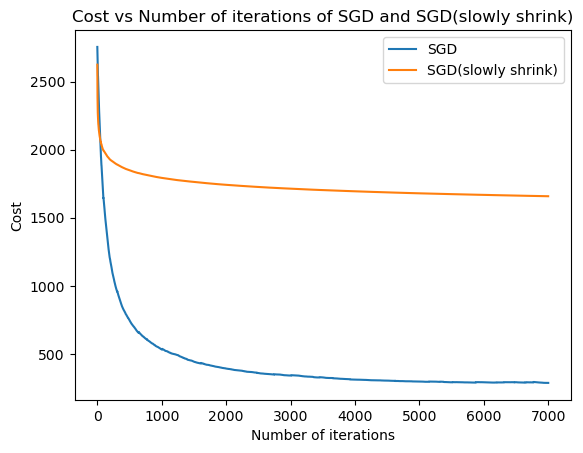

# Wine Classification with Logistic Regression

## Overview
The wine dataset data.mat consists of 6,000 sample points, each having 12 features. The description of these features is provided in data.mat. The dataset includes a training set of 5,000 sample points and a test set of 1,000 sample points. Your classifier needs to predict whether a wine is white (class label 0) or red (class label 1).

We begin by normalizing the data with each feature’s mean and standard deviation. We use training data statistics to normalize both training and validation/test data. Then add a fictitious dimension. Whenever required, we should tune hyperparameter values with cross-validation.

Look at [`Wine Classification with Logistic Regression.ipynb`]() for my implementation.

### Contents
1. Batch Gradient Descent (BGD) 
2. Stochastic Gradient Descent (SGD)
3. Slowly Shrinks SGD

### 1. Batch Gradient Descent (BGD)
After I preprocessed the data, I implemented the _Batch Gradient Descent Update_ for logistic regression with $l_2$ regularization.

$$\mathbf{w}^{(t+1)} = \mathbf{w}^{(t)} - \epsilon \left( \lambda \mathbf{w}^{(t)} - \mathbf{X}^\top ( \mathbf{y} - s(\mathbf{X} \mathbf{w}^{(t)})) \right)$$

I chose regularization parameter $\epsilon = 0.0001$ and the step size (learning rate) $\lambda = 0.1$. The BGD accuracy was 0.998.

Here is a plot of the value of the cost function versus the number of iterations spent in training.

### 2. Stochastic Gradient Descent (SGD)
Here is the SGD update law for logistic regression with $l_2$ regularization.

$$\mathbf{w}^{(t+1)} = \mathbf{w}^{(t)} - \epsilon \left( \lambda \mathbf{w}^{(t)} - n ( y_j - s(\mathbf{x}_j \cdot \mathbf{w}^{(t)})) \mathbf{x}_j^\top \right)$$

I chose regularization parameter $\epsilon = 0.01$ and the step size (learning rate) $\lambda = 0.01$. The SGD accuracy was 0.994.

Here is a plot of the value of the cost function versus the number of iterations spent in training.

### 3. Slowly Shrinks SGD
Instead of using a constant step size (learning rate) in SGD, we could use a step size that slowly shrinks from iteration to iteration. 

At first, I chose $\epsilon = 0.1$ and $\lambda = 0.01$. Then, I ran the SGD algorithm from previous part with a step size $\epsilon_t = \frac{\delta}{t}$ where $t$ is the iteration number and $\delta$ is a hyperparameter we select empirically.

Here is the plot of the value of cost function versus the number of iterations spent in training between SGD and slowly shrinks SGD.

